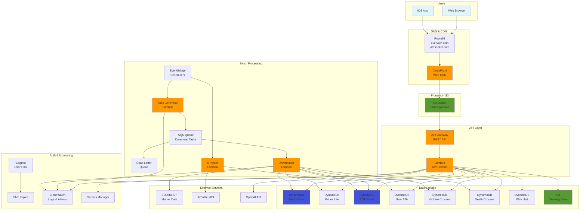
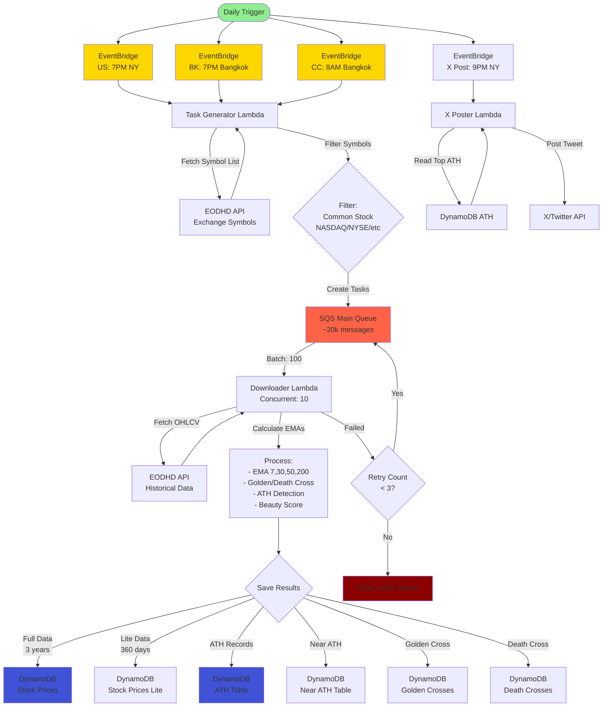
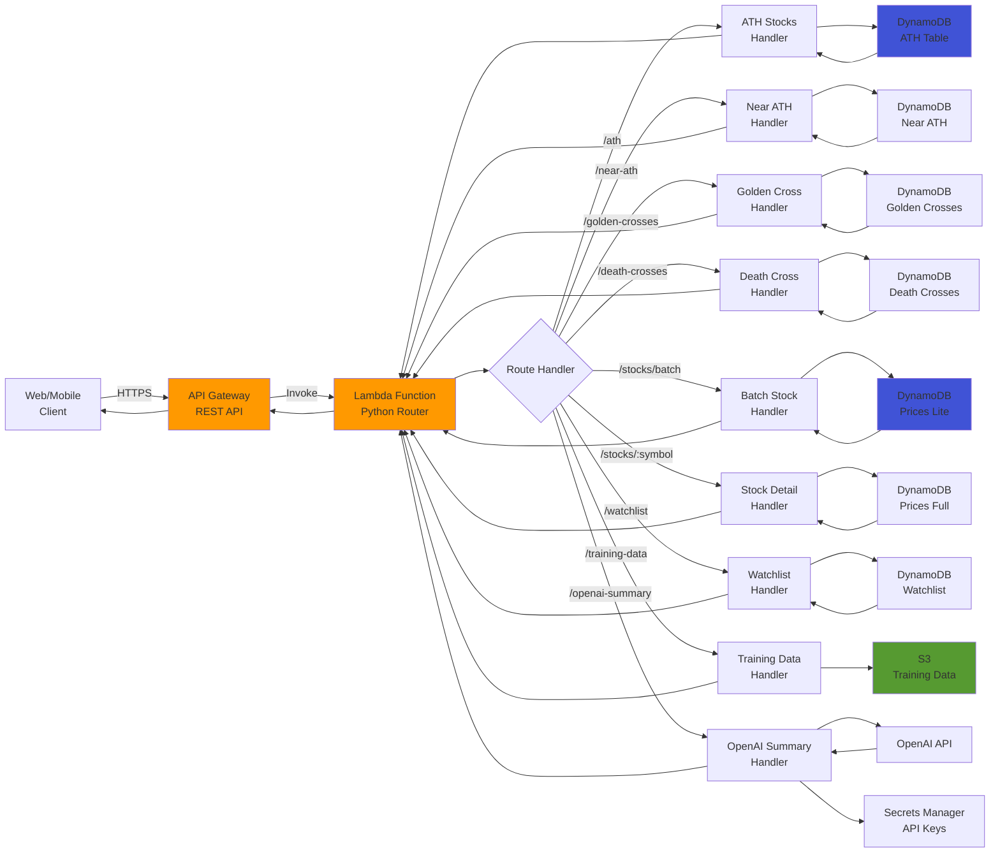
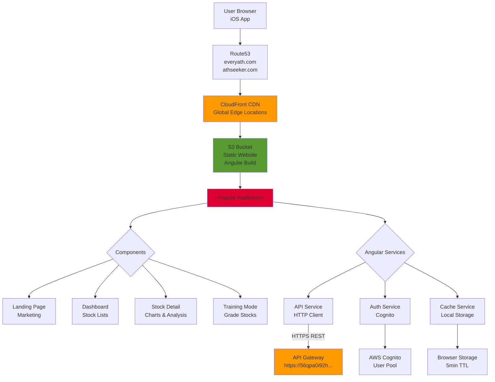
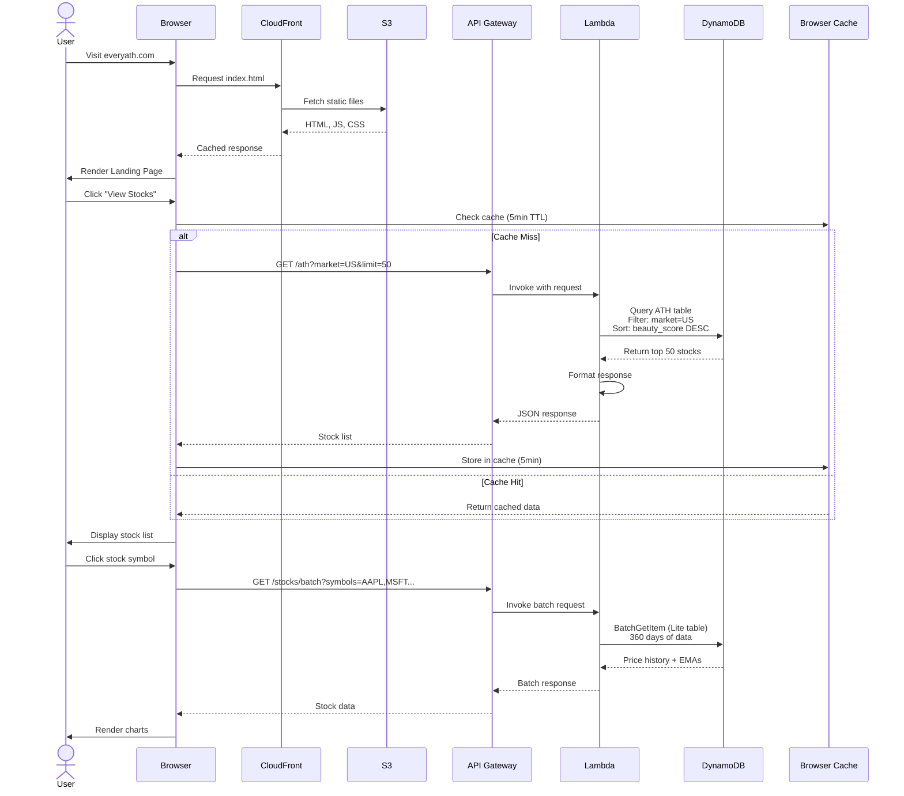
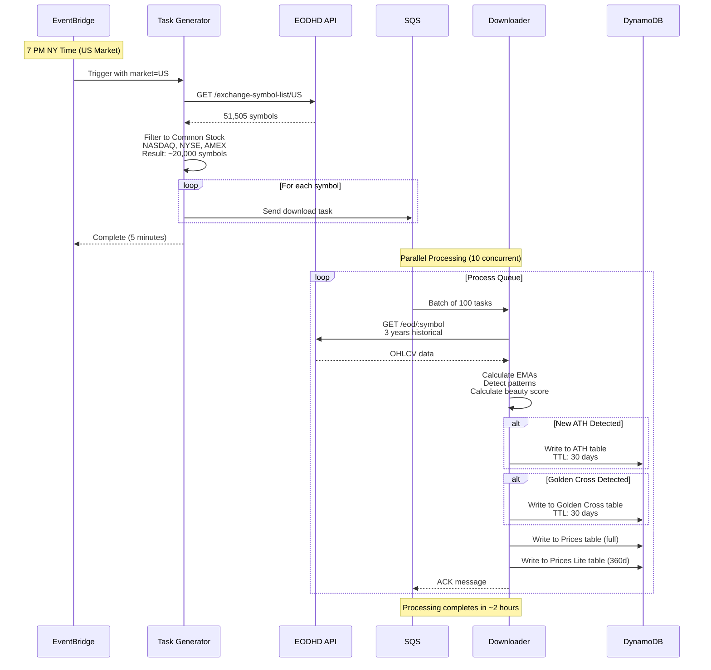
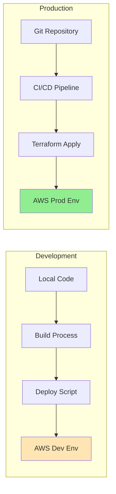

# EveryATH (ATHSeeker) System Architecture

This document provides a comprehensive overview of the EveryATH platform architecture, including all components, data flows, and AWS services.

## System Overview

EveryATH is a systematic AI platform that identifies stocks reaching all-time highs across multiple markets (US, Thailand/BK, Crypto). The system consists of three main components:

1. **Batch Processing Pipeline** - Daily data ingestion and analysis
2. **REST API** - Serves processed data to clients
3. **Web Frontend** - Angular-based user interface

## Table of Contents

- [High-Level Architecture](#high-level-architecture)
- [Batch Processing Pipeline](#batch-processing-pipeline)
- [API Layer](#api-layer)
- [Frontend Application](#frontend-application)
- [Data Flow](#data-flow)
- [Infrastructure Details](#infrastructure-details)

---

## High-Level Architecture



---

## Batch Processing Pipeline

The batch processing pipeline runs daily to fetch market data, calculate technical indicators, and detect trading signals.

### Batch Processing Flow



### Batch Schedule

| Market | Trigger Time | EventBridge Schedule | Frequency |
|--------|-------------|---------------------|-----------|
| **US** | 7 PM New York | `cron(0 23 ? * MON-FRI *)` | Mon-Fri |
| **BK** (Thailand) | 7 PM Bangkok | `cron(0 12 ? * MON-FRI *)` | Mon-Fri |
| **CC** (Crypto) | 8 AM Bangkok | `cron(0 1 * * ? *)` | Daily |
| **X Poster** | 9 PM New York | `cron(0 2 ? * TUE-SAT *)` | Mon-Fri |


### Processing Details

**Task Generator Lambda:**
- Fetches exchange symbol list from EODHD API
- Filters to Common Stock, ETF on major exchanges (NASDAQ, NYSE, AMEX for US)
- Generates ~20,000 download tasks for US market
- Sends tasks to SQS queue in batches

**Downloader Lambda:**
- Triggered by SQS messages (batch size: 100)
- Concurrent executions: 10
- Fetches 3 years of historical OHLCV data
- Calculates EMAs (7, 30, 50, 200 periods)
- Detects Golden Cross (EMA7 > EMA30) and Death Cross (EMA7 < EMA30)
- Identifies ATH (new all-time high) and Near ATH (within 5% of ATH)
- Calculates "Beauty Score" based on EMA alignment
- Stores full data (3 years) and lite data (360 days)


---

## API Layer

The API layer provides REST endpoints for the frontend to query processed stock data.

### API Architecture



### API Endpoints

| Endpoint | Method | Purpose | DynamoDB Table |
|----------|--------|---------|----------------|
| `/ath` | GET | Get ATH stocks by market | `ath` |
| `/near-ath` | GET | Get near-ATH stocks | `near-ath` |
| `/golden-crosses` | GET | Get golden cross signals | `golden-crosses` |
| `/death-crosses` | GET | Get death cross signals | `death-crosses` |
| `/stocks/batch` | GET | Get multiple stocks (lite data) | `stock-prices-lite` |
| `/stocks/:symbol` | GET | Get single stock (full data) | `stock-prices` |
| `/stocks/:symbol/history` | GET | Get historical data | `stock-prices` |
| `/watchlist` | GET/POST/DELETE | User watchlist management | `watchlist` |
| `/training-data/save-by-grade` | POST | Save training data to S3 | S3 bucket |
| `/openai-summary` | GET | Get AI-generated summary | OpenAI API |

### Authentication

- **Public Endpoints**: ATH, Near-ATH, Golden/Death Crosses, Stocks (no auth required)
- **Private Endpoints**: Watchlist (Cognito auth - planned but not implemented yet)
- **API Keys**: None currently (consider adding for rate limiting)


---

## Frontend Application

### Frontend Architecture




### Frontend Technology Stack

- **Framework**: Angular 19
- **UI Library**: Angular Material
- **Charts**: Lightweight Charts (TradingView)
- **State Management**: RxJS Observables
- **Build Tool**: Angular CLI / esbuild
- **Deployment**: S3 + CloudFront
- **Mobile**: Capacitor (iOS)

### Key Features

1. **Landing Page**: Marketing content, call-to-action
2. **Dashboard**: Browse ATH stocks, filter by market, sort by beauty score
3. **Stock Detail**: Interactive charts, technical indicators, price history
4. **Training Mode**: Label stocks with grades (A-F) for ML training data
5. **Watchlist**: Save favorite stocks (authenticated users)
6. **Multi-Market**: Support for US, Thailand (BK), Crypto (CC)


---

## Data Flow

### User Request Flow



### Daily Batch Processing Flow



---

## Infrastructure Details

### AWS Services Used

| Service | Purpose | Configuration |
|---------|---------|---------------|
| **Route53** | DNS management | Hosted zones for everyath.com, athseeker.com |
| **CloudFront** | CDN for web app | Price class 100, HTTPS only |
| **S3** | Static website hosting, training data | Versioning enabled, encrypted |
| **API Gateway** | REST API endpoints | Regional, CORS enabled, **cache disabled** |
| **Lambda** | Serverless compute | Python 3.12, 512MB-3GB memory |
| **DynamoDB** | NoSQL database | Pay-per-request, TTL enabled, PITR enabled |
| **SQS** | Message queue | Visibility timeout: 900s, DLQ enabled |
| **EventBridge** | Scheduled triggers | Multiple schedules for different markets |
| **Cognito** | User authentication | User pool with email verification |
| **Secrets Manager** | API key storage | EODHD, OpenAI, X API keys |
| **CloudWatch** | Logging & monitoring | Lambda logs, alarms for DLQ depth |
| **SNS** | Notifications | User signup notifications |
| **ACM** | SSL certificates | Multi-domain cert (*.everyath.com, *.athseeker.com) |


### DynamoDB Tables

| Table Name | Hash Key | Range Key | GSI | TTL | Purpose |
|------------|----------|-----------|-----|-----|---------|
| `stock-prices` | symbol | - | - | No | Full stock data (3 years) |
| `stock-prices-lite` | symbol | - | - | No | Lite data (360 days) for batch API |
| `ath` | symbol | - | market_code, beauty_score | 30d | ATH detection records |
| `near-ath` | symbol | - | market_code, beauty_score | 30d | Near-ATH records |
| `golden-crosses` | symbol | cross_date | market_code-cross_date | 30d | Golden cross signals |
| `death-crosses` | symbol | cross_date | market_code-cross_date | 30d | Death cross signals |
| `watchlist` | user_id | symbol | - | No | User watchlists |


### Lambda Functions

| Function | Trigger | Memory | Timeout | Concurrency | Purpose |
|----------|---------|--------|---------|-------------|---------|
| **task-generator** | EventBridge | 512 MB | 15 min | 1 | Generate download tasks |
| **downloader** | SQS | 3 GB | 15 min | 10 | Fetch & process stock data |
| **dlq-replay** | Manual | 512 MB | 5 min | 1 | Replay failed tasks |
| **x-poster** | EventBridge | 512 MB | 1 min | 1 | Post to X/Twitter |
| **tradeseeker-api** | API Gateway | 512 MB | 30 sec | 100 | Handle API requests |
| **cognito-signup-notify** | Cognito | 256 MB | 10 sec | 5 | Send signup notifications |


### Cost Optimization

**Recent Changes (July 2026):**
- ✅ **Disabled API Gateway cache cluster**: Saved $14.40/month (99% cost reduction)
  - Cache had 0% hit rate
  - Base cost eliminated
  - Client-side caching (5min TTL) provides adequate performance
- 🔄 **Proposed: CloudFront for API caching**: Free tier eligible
  - Better performance with edge locations
  - No base cost (pay per use)
  - Can implement if performance degrades

**Current Monthly Costs (estimated):**
- API Gateway: ~$0.01/month (~3,000 requests)
- Lambda: ~$5-10/month (batch processing)
- DynamoDB: ~$10-20/month (pay-per-request)
- CloudFront: Free tier (< 1TB transfer)
- S3: ~$1/month (storage + requests)
- **Total: ~$16-31/month**


### Security Features

1. **Encryption at Rest**
   - DynamoDB: Server-side encryption enabled
   - S3: Default encryption enabled
   - Secrets Manager: Encrypted storage for API keys

2. **Encryption in Transit**
   - HTTPS only (CloudFront, API Gateway)
   - TLS 1.2+ enforced

3. **IAM Roles & Policies**
   - Least privilege access
   - Lambda execution roles with scoped permissions
   - No hardcoded credentials

4. **API Security**
   - CORS enabled for specific origins
   - Rate limiting: Planned (not yet implemented)
   - Authentication: Cognito ready (not enforced on public endpoints)


5. **Monitoring & Alerts**
   - CloudWatch Logs for all Lambda functions
   - DLQ depth alarms
   - Queue age alarms

---

## Deployment Architecture

### Multi-Environment Setup




### Deployment Process

#### Frontend (Web App)
```bash
cd tradeseeker-web-v2/tradeseeker-web-v2
make all
# Steps:
# 1. npm run build (Angular production build)
# 2. aws s3 sync dist/ to S3 bucket
# 3. aws cloudfront create-invalidation
```

#### API Layer
```bash
cd tradeseeker-api-v2
make deploy
# Steps:
# 1. Install Python dependencies
# 2. Package Lambda function (zip)
# 3. terraform init
# 4. terraform plan
# 5. terraform apply (updates Lambda + API Gateway)
```

#### Batch Processing
```bash
cd tradeseeker-batch-v2
make deploy
# Steps:
# 1. Package Lambda functions
# 2. terraform apply (updates all batch Lambdas)
```


#### iOS App
```bash
cd tradeseeker-web-v2/tradeseeker-web-v2
make ios
# Steps:
# 1. npm run build
# 2. npx cap sync ios
# 3. open ios/App/App.xcworkspace (Xcode)
# 4. Manual build & deploy via Xcode
```

---

## Performance Characteristics

### API Response Times

| Endpoint | Response Time | Data Size | Caching |
|----------|---------------|-----------|---------|
| `/ath` | 100-200ms | ~50 stocks | Client: 5min |
| `/stocks/batch` | 200-500ms | ~10 stocks | Client: 5min |
| `/stocks/:symbol` | 150-300ms | 1 stock (3yr) | Client: 5min |

### Batch Processing Times

| Market | Symbols | Processing Time | Concurrency |
|--------|---------|-----------------|-------------|
| **US** | ~20,000 | ~2 hours | 10 Lambdas |
| **BK** | ~800 | ~10 minutes | 10 Lambdas |
| **CC** | ~500 | ~5 minutes | 10 Lambdas |


### Scalability

**Current Capacity:**
- API Gateway: 10,000 requests/second (AWS default)
- Lambda API: 100 concurrent executions
- Lambda Downloader: 10 concurrent executions
- DynamoDB: Pay-per-request (unlimited throughput)
- SQS: Unlimited messages

**Bottlenecks:**
- EODHD API rate limits (main constraint for batch processing)
- Lambda concurrency (can be increased)
- Frontend CloudFront edge cache (already optimized)

---

## Future Enhancements

### Planned Features

1. **API Caching with CloudFront**
   - Status: Infrastructure ready (cloudfront_api.tf created)
   - Benefit: Faster response times, lower Lambda invocations
   - Cost: Free tier eligible


2. **API Authentication & Rate Limiting**
   - Add API keys for frontend apps
   - Implement Cognito authorizer for private endpoints
   - Usage plans with throttling (100 req/sec, 10k/day)

3. **Real-time Updates**
   - WebSocket API for live stock updates
   - Server-Sent Events for notifications

4. **Advanced Analytics**
   - More technical indicators (RSI, MACD, Bollinger Bands)
   - Pattern recognition (head & shoulders, double top/bottom)
   - Backtesting framework

5. **Machine Learning**
   - Use training data to build predictive models
   - Beauty score ML model (currently rule-based)
   - Stock price prediction

6. **Mobile Apps**
   - iOS App Store deployment (Capacitor ready)
   - Android version


7. **Social Features**
   - User profiles
   - Share watchlists
   - Community discussions

---

## Technology Stack Summary

### Frontend
- **Framework**: Angular 19
- **Language**: TypeScript 5.7
- **UI**: Angular Material
- **Charts**: Lightweight Charts (TradingView)
- **State**: RxJS
- **Mobile**: Capacitor
- **Hosting**: S3 + CloudFront

### Backend
- **Runtime**: Python 3.12
- **Framework**: AWS Lambda (serverless)
- **API**: AWS API Gateway (REST)
- **Database**: AWS DynamoDB (NoSQL)
- **Queue**: AWS SQS
- **Scheduler**: AWS EventBridge
- **Auth**: AWS Cognito
- **Secrets**: AWS Secrets Manager


### Infrastructure
- **IaC**: Terraform
- **CI/CD**: Manual deployment scripts (Makefile)
- **Monitoring**: CloudWatch
- **DNS**: Route53
- **CDN**: CloudFront
- **Region**: ap-southeast-1 (Singapore)

### External APIs
- **Market Data**: EODHD (https://eodhd.com)
- **AI**: OpenAI GPT
- **Social**: X/Twitter API

---

## Repository Structure

```
athseeker-v1/
├── docs/
│   └── ARCHITECTURE.md              # This file
├── tradeseeker-api-v2/              # REST API
│   ├── src/                         # Lambda source code
│   │   ├── handlers/               # API route handlers
│   │   ├── db/                     # DynamoDB client
│   │   └── lambda_handler.py       # Main entry point
│   ├── terraform/                   # Infrastructure as Code
│   │   ├── api_gateway.tf
│   │   ├── lambda.tf
│   │   ├── dynamodb.tf
│   │   └── ...
│   ├── Makefile                     # Deployment commands
│   └── deploy.sh                    # Deployment script
├── tradeseeker-batch-v2/            # Batch processing
│   ├── lambdas/
│   │   ├── task-generator/
│   │   ├── downloader/
│   │   ├── dlq-replay/
│   │   └── x-poster/
│   ├── terraform/
│   │   ├── lambda.tf
│   │   ├── sqs.tf
│   │   ├── eventbridge.tf
│   │   └── ...
│   └── Makefile
└── tradeseeker-web-v2/
    └── tradeseeker-web-v2/          # Angular frontend
        ├── src/
        │   ├── app/
        │   │   ├── core/           # Services, guards, interceptors
        │   │   ├── features/       # Feature modules
        │   │   └── shared/         # Shared components
        │   └── environments/
        ├── terraform/               # Frontend infrastructure
        │   ├── cloudfront.tf
        │   ├── s3.tf
        │   └── route53.tf
        ├── ios/                     # Capacitor iOS app
        └── Makefile
```

---

## Contact & Maintenance

**Last Updated**: July 29, 2026
**Maintained By**: Development Team
**Architecture Version**: 2.0

For questions or updates, refer to:
- API Cost Analysis: `tradeseeker-api-v2/API_GATEWAY_COST_ANALYSIS.md`
- Cost Optimization: `tradeseeker-api-v2/COST_OPTIMIZATION_COMPLETE.md`
- Near ATH Feature: `NEAR_ATH_FEATURE.md`
- Training Workflow: `TRAINING_WORKFLOW.md`
