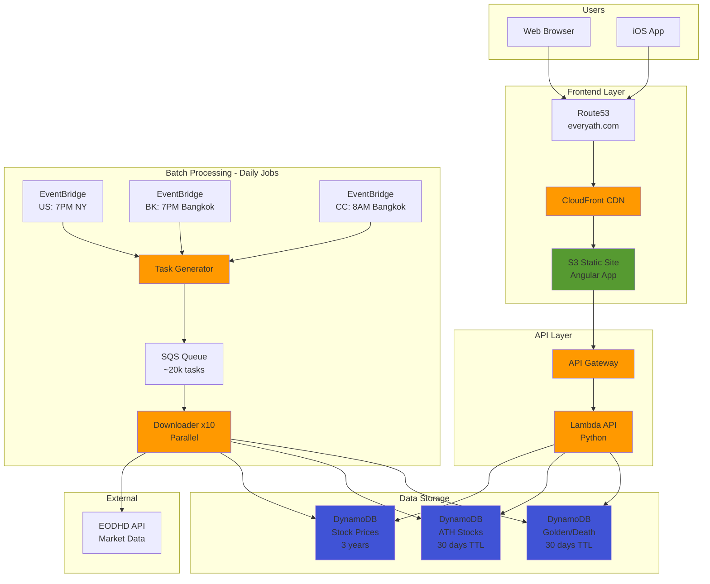

# EveryATH Architecture - Quick Reference

## System Overview (One-Page)



## Key Components

| Component | Technology | Purpose |
|-----------|-----------|---------|
| **Frontend** | Angular 19 + S3 + CloudFront | User interface, charts, stock browsing |
| **API** | API Gateway + Lambda (Python) | REST endpoints for stock data |
| **Batch** | EventBridge + SQS + Lambda | Daily data ingestion from EODHD |
| **Database** | DynamoDB (7 tables) | Stock prices, ATH, signals |
| **External** | EODHD API | Market data provider |

## Data Flow

1. **Daily**: EventBridge triggers batch job → Download 20k stocks → Store in DynamoDB
2. **User Request**: Browser → CloudFront → S3 → API Gateway → Lambda → DynamoDB → Response
3. **Caching**: Client-side 5min TTL (API Gateway cache disabled to save $14.40/month)


## API Endpoints

- `GET /ath?market=US` - Get ATH stocks
- `GET /near-ath?market=US` - Get near-ATH stocks
- `GET /golden-crosses?market=US` - Get golden cross signals
- `GET /death-crosses?market=US` - Get death cross signals
- `GET /stocks/batch?symbols=AAPL,MSFT` - Batch stock data
- `GET /stocks/:symbol` - Single stock detail

## Deployment Commands

```bash
# Frontend
cd tradeseeker-web-v2/tradeseeker-web-v2
make all

# API
cd tradeseeker-api-v2
make deploy

# Batch
cd tradeseeker-batch-v2
make deploy

# iOS
cd tradeseeker-web-v2/tradeseeker-web-v2
make ios
```

## Costs (Optimized)

- API Gateway: $0.01/month (cache disabled)
- Lambda: $5-10/month
- DynamoDB: $10-20/month
- **Total: ~$16-31/month**

## Monitoring

```bash
# Check API metrics
cd tradeseeker-api-v2
./scripts/check_api_gateway_metrics.sh
```

---

**For detailed architecture, see [ARCHITECTURE.md](./ARCHITECTURE.md)**
